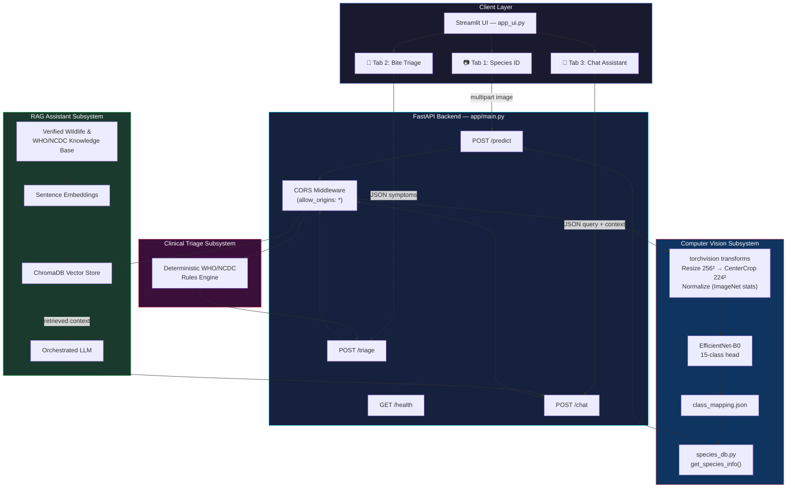
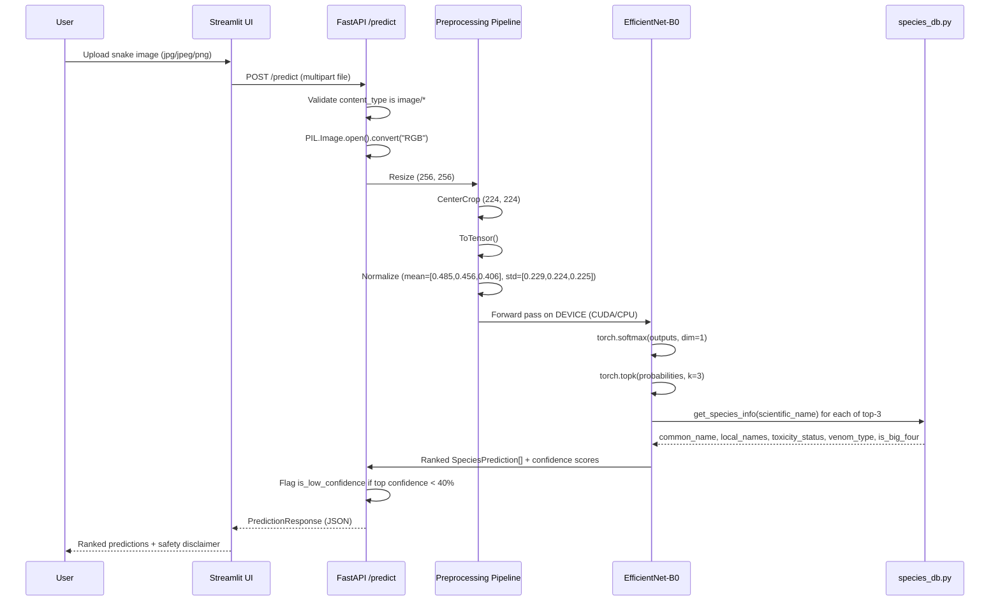

<div align="center">

# 🐍 SnakeSense

### AI-Assisted Snake Species Identification & Snakebite Emergency Guidance for India

**Computer Vision · Retrieval-Augmented Generation · Multilingual Clinical Triage**

[](https://www.python.org/)
[](https://pytorch.org/)
[](https://fastapi.tiangolo.com/)
[](https://streamlit.io/)
[](https://www.trychroma.com/)


</div>

---

> [!IMPORTANT]
> SnakeSense is a **decision-support and educational tool**, not a diagnostic or clinical device. Every prediction and RAG-generated answer is shipped with an explicit non-diagnostic disclaimer at the API level. This project does not replace antivenom administration protocols, hospital triage, or professional medical evaluation.

---

## Executive Summary

Snakebite envenoming is a WHO-recognized Neglected Tropical Disease, and India carries one of the highest snakebite mortality burdens in the world, with rural and semi-urban populations facing the compounded problem of misidentifying species in the field and delaying — or mismanaging — first response. Most existing tools address only one half of this problem: either a visual species classifier with no actionable guidance, or a static first-aid pamphlet with no adaptive intelligence. **SnakeSense** is built to close that gap by fusing computer vision, structured clinical logic, and retrieval-grounded language generation into a single, safety-first pipeline.

The system is engineered as three cooperating subsystems behind one FastAPI backend: an **EfficientNet-B0** image classifier fine-tuned to distinguish 15 snake species relevant to the Indian subcontinent, returning ranked predictions enriched with toxicity classification, venom type, and localized common names in English, Hindi, and Gujarati; a **rule-based clinical triage engine** that converts a symptom questionnaire into a WHO/NCDC-aligned urgency classification (`CRITICAL` / `HIGH` / `LOW`) with explicit do's-and-don'ts action protocols; and a **Retrieval-Augmented Generation (RAG) assistant**, built on ChromaDB, that answers free-text questions about species behavior and emergency response strictly grounded in indexed, verified wildlife and medical knowledge — engineered to avoid hallucinated clinical claims.

The engineering intent throughout is *safety-first, not confidence-first*: predictions below a 40% confidence threshold are explicitly flagged as low-confidence/ambiguous rather than silently presented as certain, every `/predict` response carries a mandatory non-diagnostic disclaimer, and the triage logic is deliberately conservative — deferring to `CRITICAL` classification whenever neurotoxic or haemotoxic red-flag symptoms (ptosis, respiratory difficulty, spontaneous bleeding) are present. The result is a project that demonstrates production-style ML engineering (checkpoint-driven model loading, typed request/response schemas, lifespan-managed startup, CORS-enabled multi-client access) applied to a domain where getting the interface right matters as much as getting the model right.

---

## Key Features

- **Multimodal Diagnostic Pipeline** — A single Streamlit interface unifies image-based species identification, structured symptom triage, and open-ended conversational Q&A into one clinical workflow rather than three disconnected tools.
- **Confidence-Aware Vision Inference** — The classifier doesn't just return a top prediction; it returns a full top-3 ranked list, computes softmax-calibrated confidence, and explicitly raises a `is_low_confidence` flag below a 40% threshold so ambiguous or blurry images are never silently over-trusted.
- **WHO/NCDC-Aligned Clinical Triage Logic** — A deterministic rules engine maps reported symptoms (ptosis, dyspnea, spontaneous bleeding, local swelling, time elapsed since bite) directly to an urgency tier and a structured `dos` / `donts` action protocol, rather than relying on a language model to reason about emergency medicine live.
- **Grounded RAG Assistant** — Free-text questions are answered by an LLM constrained to a ChromaDB-indexed knowledge base, engineered to reduce hallucination risk on high-stakes queries like "what do I do if bitten by a Common Krait at night."
- **Trilingual by Design** — Species common names and the assistant's language mode are natively surfaced in **English, Hindi (हिंदी), and Gujarati (ગુજરાતી)**, reflecting the real linguistic context of rural snakebite incidents in India.
- **Session-Aware Context Injection** — The chat assistant carries forward the "active species context" from a user's most recent image upload within the same session, so follow-up questions don't require re-stating which snake was identified.
- **Typed, Contract-First API Surface** — Every endpoint (`/predict`, `/triage`, `/chat`, `/health`) is backed by explicit Pydantic response models, giving the system a stable, versionable contract instead of ad-hoc JSON.
- **Lifespan-Managed Model & Index Loading** — The FastAPI `lifespan` context loads the model checkpoint, class mapping, and RAG knowledge base index exactly once at startup rather than per-request, keeping inference latency low and avoiding redundant I/O.

---

## System Architecture & Pipeline

SnakeSense is architected around a single FastAPI application (`app/main.py`) that owns model lifecycle, request validation, and routing, fronted by a Streamlit multi-tab client (`app_ui.py`). The backend loads its EfficientNet-B0 checkpoint and class mapping once at process startup via a `lifespan` context manager, and simultaneously triggers `index_knowledge_base()` to prepare the ChromaDB vector store for the RAG assistant — meaning the first request served is already warm.

Each of the three user-facing capabilities routes to an isolated concern: `/predict` is a pure computer-vision path (image in, ranked species predictions out), `/triage` is a pure deterministic-logic path (symptom JSON in, urgency classification out, **no model inference involved**), and `/chat` is the only path that touches the LLM, and only after retrieval has grounded it in indexed source material.



### Data Ingestion & Model Pipeline

The vision model's path from raw image to structured prediction follows a fixed preprocessing contract that must match training-time normalization exactly, since any mismatch here silently degrades accuracy without raising an error.



> [!NOTE]
> The `/triage` endpoint is intentionally excluded from any model or LLM call path. Emergency urgency classification is computed by deterministic conditional logic in `main.py` alone — a design choice made so that clinical urgency decisions are auditable, reproducible, and not subject to model drift or hallucination.

---

## Tech Stack Matrix

| Category | Technology | Purpose |
|---|---|---|
| **Computer Vision / Core AI** | PyTorch, `torchvision.models.efficientnet_b0` | Backbone architecture for 15-class snake species image classification |
| **Computer Vision / Core AI** | OpenCV | Image preprocessing utilities in the training/data pipeline |
| **RAG** | ChromaDB | Vector store for indexing and retrieving the verified wildlife/medical knowledge base |
| **RAG** | Hugging Face (Sentence-Transformers ecosystem) | Text embedding generation for semantic retrieval |
| **Backend & API** | FastAPI | Typed REST API serving `/health`, `/predict`, `/triage`, and `/chat` |
| **Backend & API** | Pydantic | Request/response schema validation (`PredictionResponse`, `TriageRequest`, `ChatResponse`, etc.) |
| **Backend & API** | Python `contextlib.asynccontextmanager` (FastAPI `lifespan`) | One-time model checkpoint, class mapping, and RAG index loading at startup |
| **Frontend / UI** | Streamlit | Multi-tab client for image upload, symptom triage form, and chat interface |
| **Frontend / UI** | Pillow (PIL) | Client and server-side image handling |
| **Infrastructure** | CORS Middleware (FastAPI) | Cross-origin access enabled for local testing and prospective mobile client connectivity |
| **Data & Experimentation** | Jupyter Notebooks (`snakesense.ipynb`, `preprocessing.ipynb`, `data_augmentation.ipynb`, `dataset_loader.ipynb`, `duplicate_detection.ipynb`) | Dataset engineering, preprocessing, augmentation, deduplication, and model training workflows |
| **Testing** | Pytest (`conftest.py`, `tests/`) | Test suite for API endpoint correctness |

---

## Machine Learning & Engineering Deep Dive

### Model Architecture

The deployed classifier is a **EfficientNet-B0** (`torchvision.models.efficientnet_b0`), instantiated with `weights=None` (trained from scratch on the project's own dataset rather than fine-tuned from ImageNet weights in the deployed loader) and re-headed for the task: the final classifier layer's `in_features` is extracted and replaced with a fresh `nn.Linear(num_features, num_classes)` sized to the 15 registered species. Trained weights are restored from a checkpoint at `checkpoints/best_model.pth`, with the loader handling both raw state-dict checkpoints and dictionary-wrapped checkpoints (`checkpoint["model_state_dict"]`) for flexibility across training run formats.

### Preprocessing Contract

Inference-time preprocessing is defined as a fixed `torchvision.transforms.Compose` pipeline, deliberately kept identical to the validation-time transform used during training:

```python
eval_transform = transforms.Compose([
    transforms.Resize((256, 256)),
    transforms.CenterCrop((224, 224)),
    transforms.ToTensor(),
    transforms.Normalize(
        mean=[0.485, 0.456, 0.406],
        std=[0.229, 0.224, 0.225]
    )
])
```

### Class Mapping & Species Metadata

The 15-class label space is externalized to `models/class_mapping.json`, loaded and cast to an `int → str` mapping at startup. Each predicted class index is resolved to a scientific name, which is then enriched via `species_db.get_species_info()` — returning `common_name`, `local_names` (a dict keyed by language code for English/Hindi/Gujarati), `toxicity_status`, `venom_type`, and an `is_big_four` flag (referencing India's "Big Four" medically significant venomous species: Indian cobra, common krait, Russell's viper, and saw-scaled viper).

### Confidence Calibration & Low-Confidence Safeguard

Raw logits are converted to probabilities via `torch.softmax`, and the top-3 classes are extracted via `torch.topk`. Critically, the system does not treat the top-1 prediction as ground truth by default — if the top prediction's confidence falls below **40%**, the response sets `is_low_confidence = True`, which the UI surfaces as an explicit warning: *"The image may be blurry or ambiguous. Treat as potentially venomous."* This is a deliberate fail-safe bias — under identification uncertainty, the system defaults toward caution rather than false reassurance.

### Logged Performance Metrics

| Metric | Value | Notes |
|---|---|---|
| **Backbone** | EfficientNet-B0 | `torchvision.models.efficientnet_b0`, custom 15-class head |
| **Top-3 Test Accuracy** | **87.24%** | Formally logged during test-set evaluation |
| **Inference Latency** | **< 100 ms / image** | Measured on GPU/CUDA |
| **Classes Registered** | **15 species** | Indices `0`–`14`, sourced from `class_mapping.json` |
| **Per-Species Precision / Recall** | *Not logged* | Not recorded in the training run logs — flagged here rather than estimated |
| **Confusion Matrix** | *Not logged* | Full per-class confusion matrix was not captured during this training run |


### Clinical Triage Logic

The `/triage` endpoint implements a fully deterministic decision tree — no model inference occurs on this path. Given a `bitten` flag and four boolean symptom fields (`local_swelling`, `drooping_eyelids`, `difficulty_breathing`, `spontaneous_bleeding`) plus `time_elapsed_minutes`, urgency is classified as follows:

- If `bitten` is `False` → `urgency_level = "LOW"`, no bite reported, maintain safe distance.
- If any of `drooping_eyelids`, `difficulty_breathing`, or `spontaneous_bleeding` is `True` → `urgency_level = "CRITICAL"`, `suspected_toxicity = "Systemic Envenoming (Neurotoxic / Haemotoxic)"`.
- Otherwise (bitten, but none of the critical red-flag symptoms present) → `urgency_level = "HIGH"`, `suspected_toxicity = "Potential Local Envenoming"`.

Every triage response returns a structured `action_protocol` with an `immediate_action` string, a `dos` list (immobilize the limb, remove restrictive jewelry, transport to a facility with antivenom/ICU access), and a `donts` list (no incision, no suction, no tourniquet, no herbal remedies or ice, no alcohol/caffeine/analgesics) — directly reflecting standard WHO/NCDC snakebite first-aid guidance.

### RAG Assistant Design

The `/chat` endpoint delegates to `generate_rag_answer(user_query, species_context, language)` in `app/rag_engine.py`. The knowledge base is indexed once at application startup via `index_knowledge_base()` inside the FastAPI `lifespan` handler, backed by ChromaDB as the vector store. The assistant accepts an optional `species_context` string — populated automatically by the UI from the most recently identified species in the session — allowing follow-up questions like *"is this one dangerous at night?"* to resolve without the user re-stating which snake they mean.

---

## Directory Structure

```SNAKESENSE/
├── .gitignore
├── README.md
├── app_ui.py
├── conftest.py
├── data_augmentation.ipynb
├── dataset_loader.ipynb
├── duplicate_detection.ipynb
├── preprocessing.ipynb
├── snakesense.ipynb
├── app/
│   ├── main.py
│   ├── rag_engine.py
│   ├── schemas.py
│   ├── species_db.py
├── checkpoints/
├── chroma_db/
│   ├── chroma.sqlite3
├── data/
│   ├── knowledge_base/
│   │   ├── indian_species_profiles.txt
│   │   └── who_ncdc_guidelines.txt
│   ├── Processed_Images/
│   │   ├── Processed_test/
│   │   ├── Processed_train/
│   │   └── Processed_valid/
│   └── raw/
│       ├── test/
│       ├── train/
│       ├── valid/
│       └── README.dataset.txt
├── models/
└── tests/
    ├── test_api.py

```

> [!NOTE]
> `checkpoints/` and `models/` are referenced explicitly by path in `app/main.py`'s `lifespan` handler but are excluded from version control via `.gitignore` (standard practice for binary model artifacts) — they must be generated locally by running the training notebooks or downloaded separately before the API will start.

---

## Getting Started & Setup Guide

### Prerequisites

- **Python**: 3.10 or higher
- **CUDA-capable GPU** (recommended): for sub-100ms inference latency; the app auto-detects and falls back to CPU otherwise (`torch.device("cuda" if torch.cuda.is_available() else "cpu")`)
- **Core dependencies**: PyTorch, torchvision, FastAPI, Uvicorn, Streamlit, Pillow, ChromaDB, Pydantic, Pytest


### Local Setup

```bash
# 1. Clone the repository
git clone https://github.com/Samirhadiyal/SnakeSense.git
cd SnakeSense

# 2. Create and activate a virtual environment
python -m venv venv
source venv/bin/activate        # Linux/macOS
venv\Scripts\activate           # Windows

# 3. Install dependencies
pip install torch torchvision fastapi uvicorn streamlit pillow chromadb pydantic pytest

# 4. Ensure model artifacts are present
#    - checkpoints/best_model.pth   (trained EfficientNet-B0 weights)
#    - models/class_mapping.json    (15-class label mapping)
#    Generate these by running snakesense.ipynb end-to-end, or place
#    pre-trained artifacts in these exact paths.

# 5. Start the FastAPI backend
uvicorn app.main:app --reload --host 127.0.0.1 --port 8000

# 6. In a separate terminal, start the Streamlit UI
streamlit run app_ui.py
```

The Streamlit UI expects the backend at `http://127.0.0.1:8000` by default (hardcoded `API_URL` in `app_ui.py`) — update this constant if deploying the backend elsewhere.

### Running Tests

```bash
pytest tests/ -v
```

---

## API & Usage Reference

### Endpoint Summary

| Method | Endpoint | Payload | Description |
|---|---|---|---|
| `GET` | `/health` | — | Returns service status, active device (CPU/CUDA), model load state, and registered class count |
| `POST` | `/predict` | `multipart/form-data` (image file) | Runs EfficientNet-B0 inference, returns top-3 ranked species predictions with confidence, toxicity, and localized names |
| `POST` | `/triage` | `application/json` (symptom fields) | Deterministic WHO/NCDC-aligned urgency classification with action protocol |
| `POST` | `/chat` | `application/json` (query, context, language) | RAG-grounded conversational answer from the verified knowledge base |

### `GET /health`

**Sample Response**

```json
{
  "status": "healthy",
  "device": "cuda",
  "model_loaded": true,
  "classes_registered": 15
}
```

### `POST /predict`

**Request**: `multipart/form-data` with a single `file` field (`image/jpeg`, `image/png`, or `image/jpg`).

**Sample Response**

```json
{
  "status": "success",
  "is_low_confidence": false,
  "top_predictions": [
    {
      "rank": 1,
      "scientific_name": "Naja naja",
      "common_name": "Indian Cobra",
      "local_names": {
        "en": "Indian Cobra",
        "hi": "नाग",
        "gu": "નાગ"
      },
      "confidence_percentage": 92.47,
      "toxicity_status": "HIGHLY VENOMOUS",
      "venom_type": "Neurotoxic",
      "is_big_four": true
    },
    {
      "rank": 2,
      "scientific_name": "Ptyas mucosa",
      "common_name": "Indian Rat Snake",
      "local_names": {
        "en": "Indian Rat Snake",
        "hi": "धामन",
        "gu": "ધામણ"
      },
      "confidence_percentage": 5.12,
      "toxicity_status": "NON-VENOMOUS",
      "venom_type": "None",
      "is_big_four": false
    },
    {
      "rank": 3,
      "scientific_name": "Bungarus caeruleus",
      "common_name": "Common Krait",
      "local_names": {
        "en": "Common Krait",
        "hi": "करैत",
        "gu": "કરૈત"
      },
      "confidence_percentage": 1.83,
      "toxicity_status": "HIGHLY VENOMOUS",
      "venom_type": "Neurotoxic",
      "is_big_four": true
    }
  ],
  "safety_disclaimer": "CRITICAL DISCLAIMER: AI image predictions are non-diagnostic. Never handle wild snakes or delay medical evaluation based on prediction confidence."
}
```

> [!NOTE]
> The exact `local_names`, `toxicity_status`, and `venom_type` values shown above illustrate the response *shape* as defined by `SpeciesPrediction` in `app/schemas.py` and populated via `species_db.get_species_info()`; the specific per-species metadata values live in that module and are not reproduced here verbatim from source.

### `POST /triage`

**Sample Request**

```json
{
  "bitten": true,
  "time_elapsed_minutes": 15,
  "local_swelling": true,
  "drooping_eyelids": true,
  "difficulty_breathing": false,
  "spontaneous_bleeding": false
}
```

**Sample Response**

```json
{
  "urgency_level": "CRITICAL",
  "suspected_toxicity": "Systemic Envenoming (Neurotoxic / Haemotoxic)",
  "action_protocol": {
    "immediate_action": "RUSH TO NEAREST DISTRICT HOSPITAL OR PRIMARY HEALTH CENTER",
    "dos": [
      "Reassure the victim and keep them completely calm.",
      "Immobilize the bitten limb with a splint or loose bandage.",
      "Remove tight jewelry, rings, watches, or restrictive clothing.",
      "Transport the victim to a facility with Antivenom (ASV) and ICU facilities immediately."
    ],
    "donts": [
      "DO NOT cut or incision the bite wound.",
      "DO NOT attempt to suck venom by mouth or device.",
      "DO NOT apply a tight tourniquet or tight rope.",
      "DO NOT apply herbal remedies, ice, or chemicals.",
      "DO NOT give the victim alcohol, caffeine, or pain medication."
    ]
  },
  "emergency_contacts": ["108 (Emergency Ambulance)", "112 (National Emergency Response)"]
}
```

### `POST /chat`

**Sample Request**

```json
{
  "query": "What should I do if someone is bitten by a Common Krait at night?",
  "species_context": "Predicted species: Bungarus caeruleus (Common Krait)",
  "language": "English"
}
```

**Sample Response**

```json
{
  "query": "What should I do if someone is bitten by a Common Krait at night?",
  "answer": "Common Krait bites are frequently painless and may go unnoticed until neurotoxic symptoms appear. Seek emergency care immediately regardless of visible symptoms, immobilize the limb, and monitor closely for drooping eyelids or breathing difficulty en route to the nearest facility with antivenom availability.",
  "language": "English"
}
```

> [!NOTE]
> The `answer` field above is an illustrative example of the response shape, not a verbatim transcript of `rag_engine.generate_rag_answer()` output — actual answers are generated dynamically from the indexed knowledge base at query time.

**Output**
 <br> <br> 
 <br> <br>
 <br> <br>
 <br> <br>
 <br> <br>
 <br> <br>


---

<div align="center">

**⚠️ SnakeSense is a decision-support tool, not a substitute for professional medical care. In a suspected snakebite emergency, seek immediate hospital treatment.**

</div>
